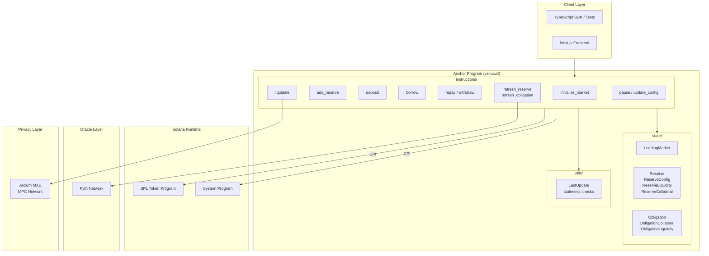
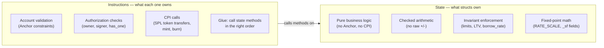
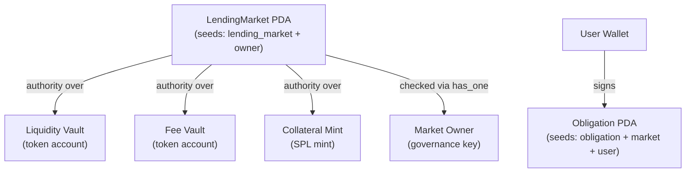
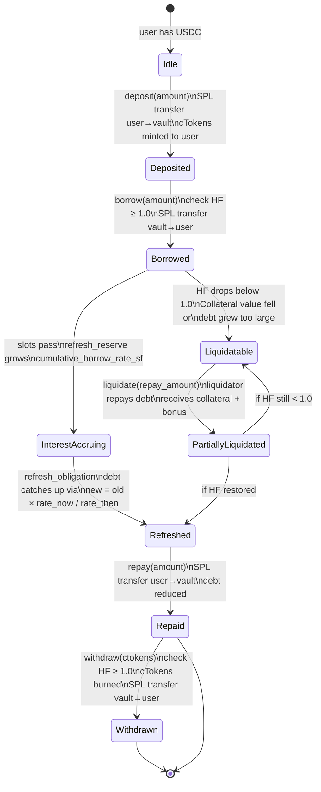
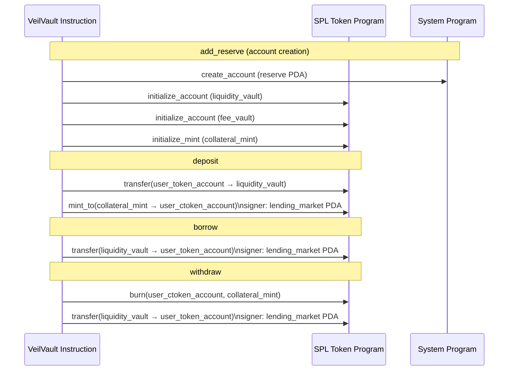

# VeilVault — Architecture

## Layers



---

## Component Responsibilities



---

## Account Authority Map



---

## Instruction Permission Matrix

```
Instruction          │ Anyone │ Owner only │ Paused market blocks
─────────────────────┼────────┼────────────┼─────────────────────
initialize_market    │        │     ✓      │
add_reserve          │        │     ✓      │       ✓
deposit              │   ✓    │            │       ✓
borrow               │   ✓    │            │       ✓
repay                │   ✓    │            │
withdraw             │   ✓    │            │       ✓
refresh_reserve      │   ✓    │            │
refresh_obligation   │   ✓    │            │
liquidate            │   ✓    │            │       ✓
pause / unpause      │        │     ✓      │
update_reserve_config│        │     ✓      │
```

---

## Data Flow — Full Deposit Lifecycle



---

## Cross-Program Invocations


