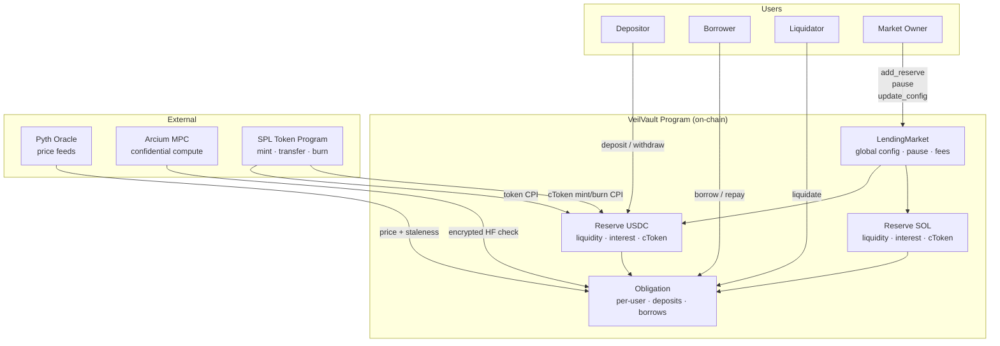
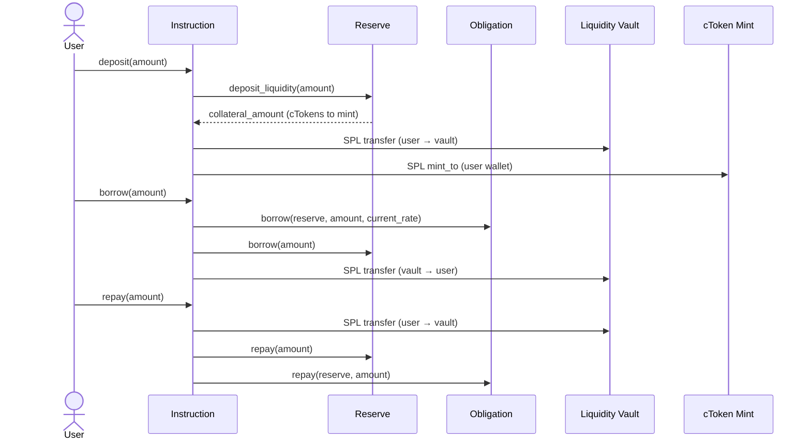
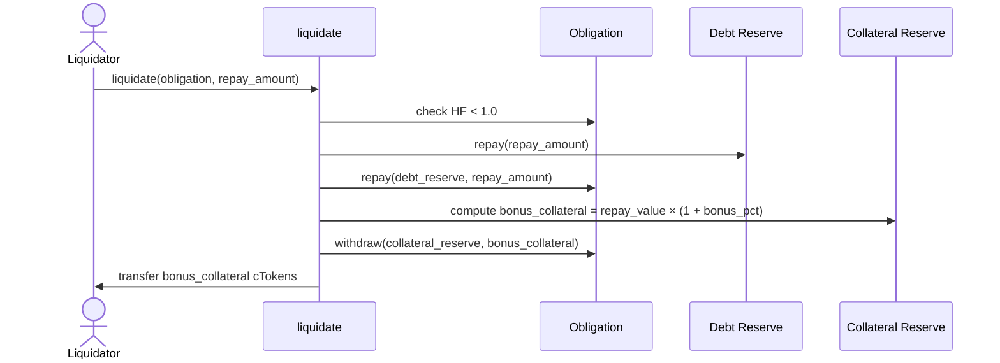
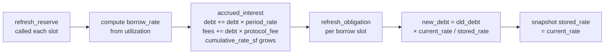
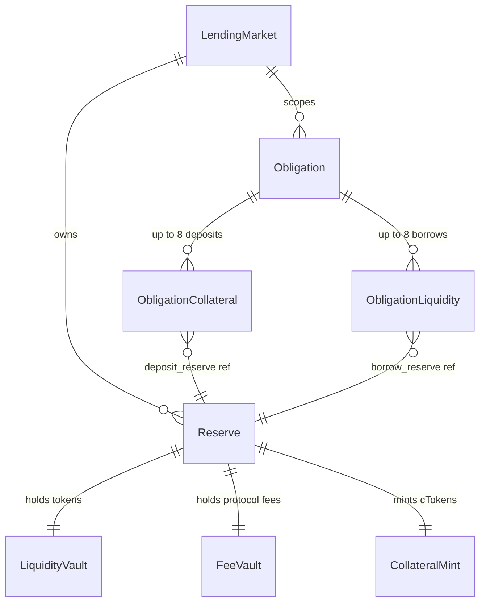
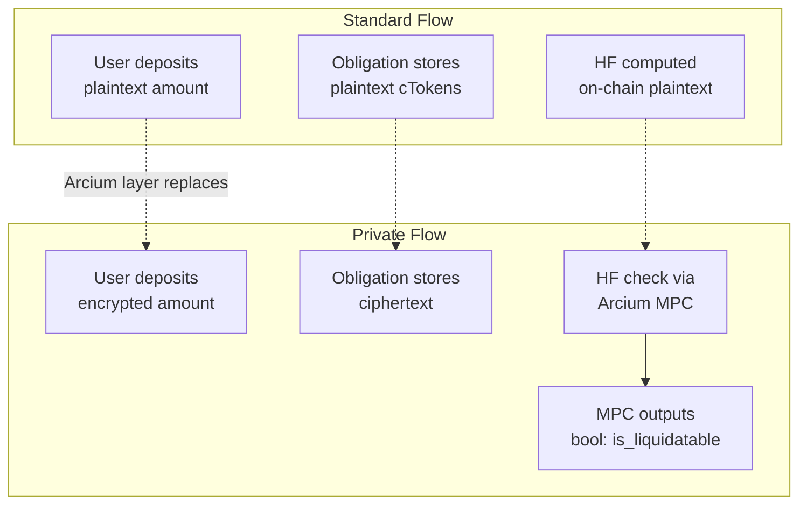

# VeilVault — High Level Diagram

## System Components

---

## User Flows

### Deposit → Borrow → Repay

### Liquidation

### Interest Accrual

---

## Account Relationships

---

## Privacy Extension (Arcium)

