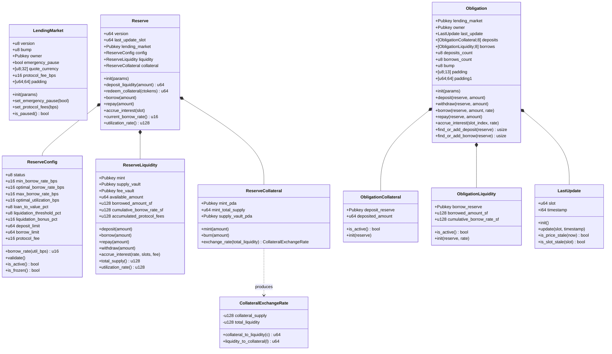
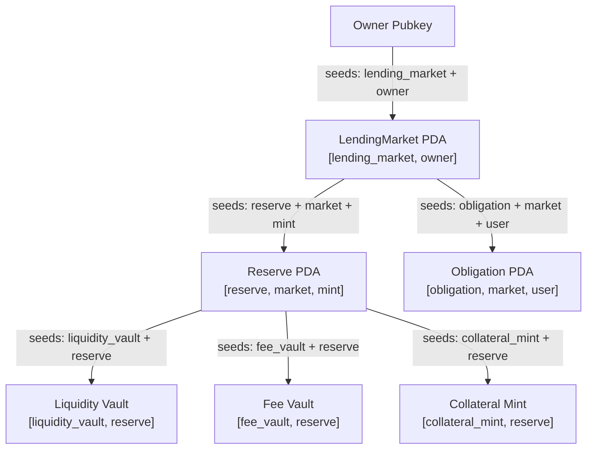
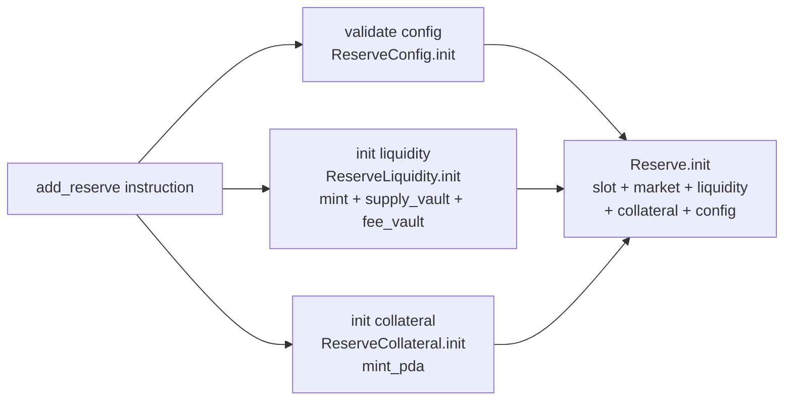
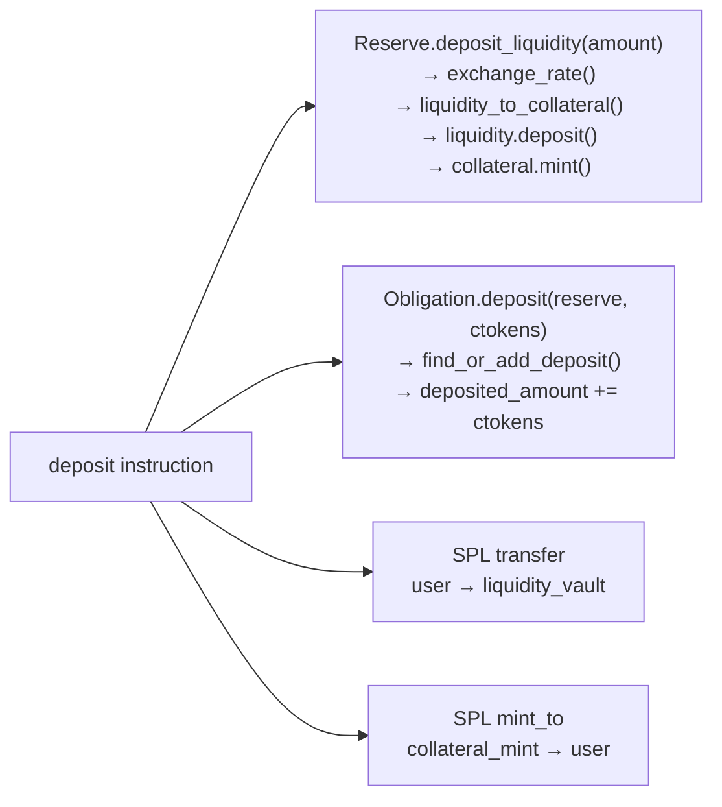
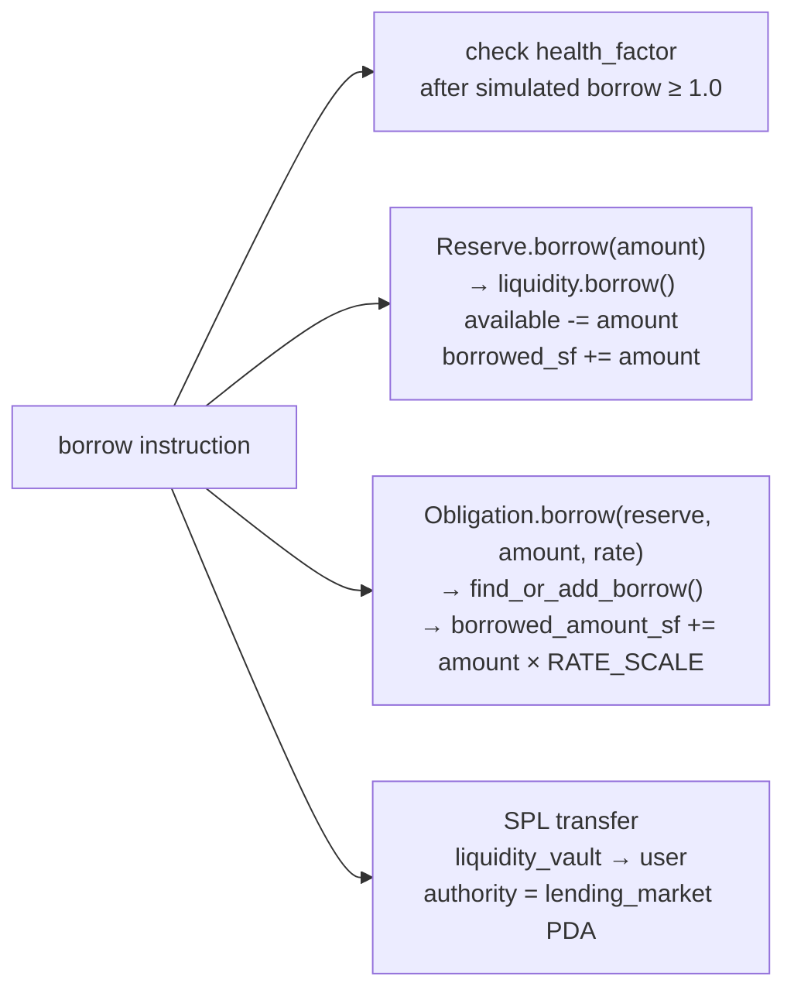

# VeilVault — Low Level Diagram

## Struct Layout



---

## Memory Layout — Obligation (1440 bytes)

```
Offset   Size   Field
──────────────────────────────────────────────────────
0        32     lending_market: Pubkey
32       32     owner: Pubkey
64       16     last_update: LastUpdate (slot:u64 + timestamp:i64)
80       320    deposits: [ObligationCollateral; 8]
                  each slot = 32 (Pubkey) + 8 (u64) = 40 bytes
400      512    borrows: [ObligationLiquidity; 8]
                  each slot = 32 (Pubkey) + 16 (u128) + 16 (u128) = 64 bytes
912      1      deposits_count: u8
913      1      borrows_count: u8
914      1      bump: u8
915      13     padding: [u8;13]   ← closes gap to 16-byte boundary
928      512    padding1: [u64;64]
──────────────────────────────────────────────────────
Total:   1440   1440 % 16 == 0 ✓ no hidden gaps
```

---

## PDA Derivation Tree



---

## Interest Rate Curve

```
Borrow Rate (bps)
│
max ──────────────────────────── ●
10000│                          /
     │                         /  segment 2
     │                        /   (steep slope)
opt ─│──────────── ●
2000 │            /●
     │           / |
     │          /  |
     │         /   |  segment 1
     │        /    |  (gentle slope)
min ─│── ●   /     |
200  │   |  /      |
     │   | /       |
     └───┼─────────┼────────── Utilization (bps)
         0       8000      10000
                 optimal
```

---

## Instruction → State Call Chain

### `add_reserve`



### `deposit` (planned)



### `borrow` (planned)



---

## Fixed-Point Math Reference

```
RATE_SCALE = 1_000_000_000_000  (1e12)

Period rate (per slot, scaled):
  period_rate = borrow_rate_bps × slots_elapsed × RATE_SCALE
                ─────────────────────────────────────────────
                        SLOTS_PER_YEAR × BPS_SCALER

Debt accrual on Reserve:
  new_debt_sf = old_debt_sf + old_debt_sf × period_rate / RATE_SCALE

Cumulative rate index growth:
  new_rate_sf = old_rate_sf + old_rate_sf × period_rate / RATE_SCALE

Debt catch-up on Obligation (at refresh):
  new_debt_sf = old_debt_sf × current_rate_sf / stored_rate_sf
```
