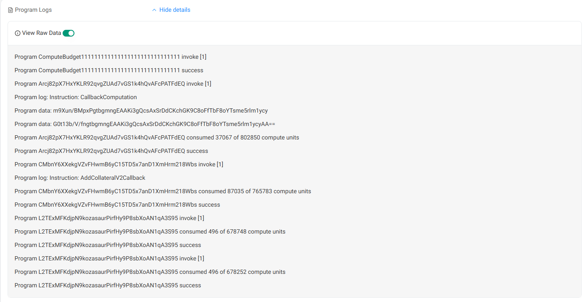
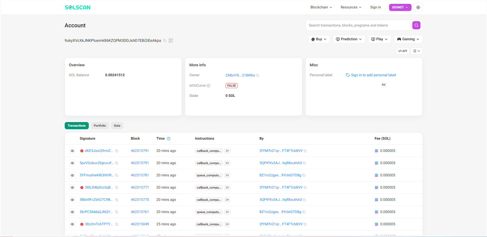
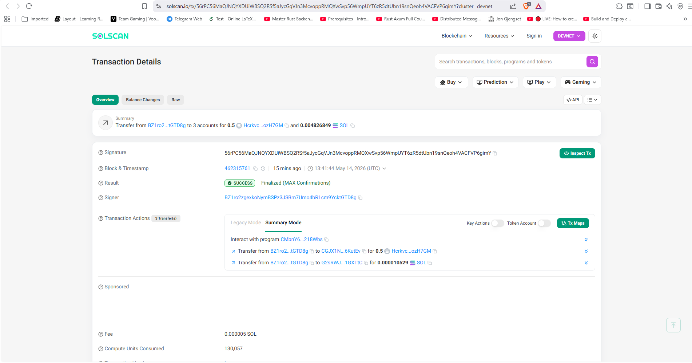
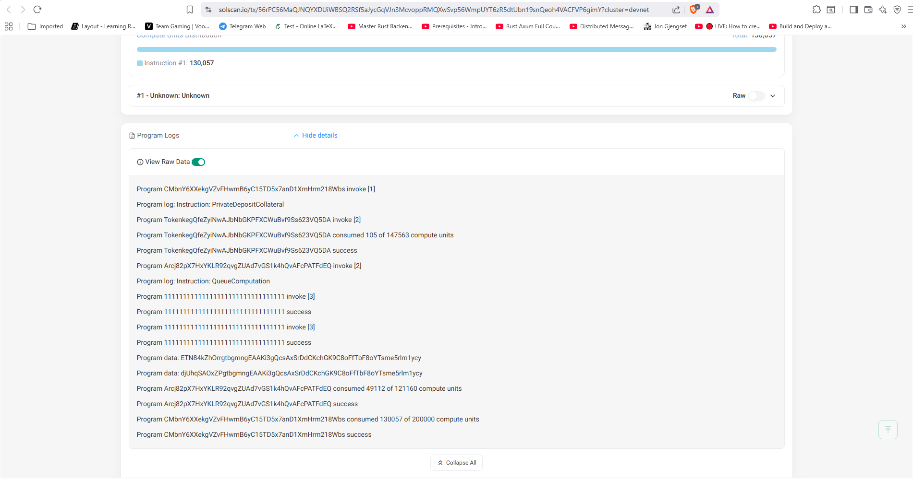
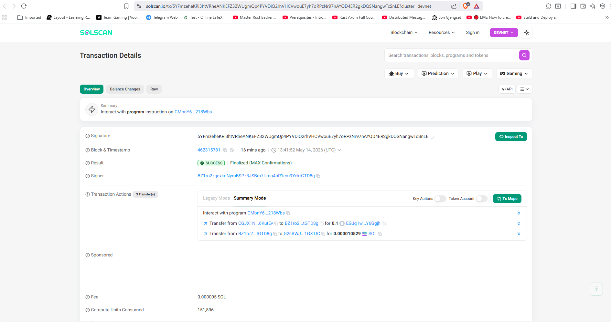
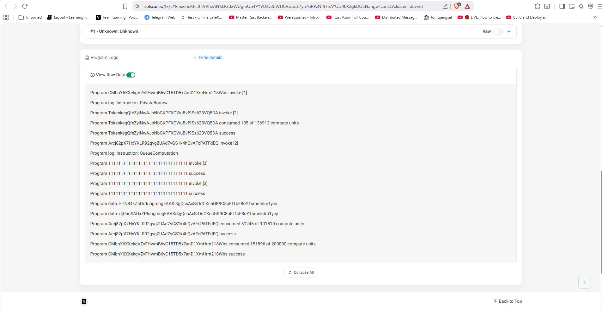

<p align="center">
  
</p>

<h1 align="center">VeilVault</h1>

<p align="center">
  <strong>A confidential lending protocol on Solana</strong><br>
  Users deposit collateral, borrow against it, and repay — with positions kept private via Arcium MPC.<br>
  Liquidations execute correctly over encrypted data without exposing individual balances.<br><br>
  <strong>Track:</strong> DeFi + Privacy (Colosseum Frontier)
</p>

---

## What Makes It Different

Standard lending protocols (Kamino, Marginfi) store all positions in plaintext on-chain. VeilVault encrypts collateral amounts, borrow amounts, and health factors using Arcium's MPC network. The protocol enforces solvency and triggers liquidations without ever revealing a user's position to external observers.

This is the only Solana lending protocol where the liquidator learns only *whether* a position is liquidatable — not the exact collateral or debt amounts.

---

## Architecture

### Accounts

| Account | Description |
|---|---|
| `LendingMarket` | Global config — owner, quote currency, emergency pause, protocol fee |
| `Reserve` | Per-asset state — liquidity vault, collateral mint, interest model, Pyth oracle |
| `Obligation` | Per-user state — deposited collateral and borrowed amounts across reserves |
| `PrivateObligation` | Per-user encrypted state — ciphertext via Arcium MXE |

### PDAs

```
LendingMarket:      ["lending_market", owner]
Reserve:            ["reserve", lending_market, mint]
Liquidity vault:    ["liquidity_vault", reserve]
Fee vault:          ["fee_vault", reserve]
Collateral mint:    ["collateral_mint", reserve]
Collateral supply:  ["collateral_supply", reserve]
Obligation:         ["obligation", lending_market, user]
```

### Collateral Tokens (cTokens)

When a user deposits, the protocol mints cTokens at the current exchange rate. The exchange rate appreciates over time as interest accrues — cTokens automatically compound interest without per-user bookkeeping.

```
exchange_rate = total_liquidity_supply / ctoken_supply
total_liquidity_supply = available + borrowed − accumulated_protocol_fees
```

Depositing into an empty pool always mints 1:1. After interest accrues, each cToken redeems for more underlying than was deposited.

---

## Instructions

### Core Lending (15 instructions)

```
initialize_market        — create LendingMarket PDA (admin only)
add_reserve              — register a new asset; create vault, fee vault, cToken mint/supply PDAs
init_obligation          — create a per-user Obligation PDA (one per market)
deposit                  — underlying → liquidity_vault, mint cTokens to user
deposit_collateral       — lock cTokens into Obligation.deposits[] to post collateral
borrow                   — liquidity_vault → user, record debt in Obligation (requires fresh refresh)
repay                    — user → liquidity_vault, reduce Obligation debt
withdraw_collateral      — unlock cTokens from Obligation; requires refresh_obligation in same slot
withdraw                 — burn cTokens, return underlying from liquidity_vault
refresh_reserve          — accrue interest + update Pyth oracle price
refresh_obligation       — recompute borrow/collateral USD values via reserve prices
liquidate                — repay debt, seize cToken collateral with bonus (50% close factor)
set_pause                — toggle emergency pause; blocks deposit/borrow/withdraw when active
update_reserve_config    — owner-only reconfiguration of all ReserveConfig parameters
update_market_authority  — transfer market ownership to a new authority
```

### Arcium MPC Privacy Layer (11 instructions)

```
init_private_obligation     — create PrivateObligation PDA; queue init_position MPC computation
init_position_callback      — MXE writes initial encrypted PrivatePosition into enc_state
private_deposit_collateral  — SPL transfer + queue add_collateral MPC update
add_collateral_callback     — MXE updates encrypted collateral field
private_borrow              — SPL transfer + queue add_borrow MPC update (inline plaintext HF check)
add_borrow_callback         — MXE updates encrypted borrow field
private_check_liquidatable  — queue check_health MPC (computes HF over encrypted data)
check_health_callback       — set is_liquidatable flag + emit LiquidatableEvent
execute_private_liquidation — seize collateral for positions flagged is_liquidatable
init_position_comp_def      — one-time circuit registration
add_collateral_comp_def / add_borrow_comp_def / check_health_comp_def — circuit registration
```

Circuit definitions in `encrypted-ixs/`: `init_position`, `add/remove_collateral`, `add/remove_borrow`, `check_health` — all compiled via the `tools/circuit-builder` binary.

---

## Interest Rate Model

Utilization-based kinked curve — low rates at low utilization, steep rates above the optimal kink:

```
utilization = borrowed / total_supply

if utilization <= optimal:
    rate = min_rate + (utilization / optimal) × (optimal_rate − min_rate)
else:
    rate = optimal_rate + ((utilization − optimal) / (1 − optimal)) × (max_rate − optimal_rate)
```

Interest is tracked via a cumulative borrow rate index on the `Reserve`. Each `Obligation` stores the index at its last interaction. Accrual is a single multiply-then-divide — no per-user loops.

---

## Health Factor

```
HF = Σ(collateral_value × liquidation_threshold) / Σ(borrow_value)
```

- `HF ≥ 1.0` — healthy
- `HF < 1.0` — liquidatable

Oracle prices from Pyth with dual staleness checks (slot-based and timestamp-based). `borrow` requires `refresh_obligation` in the same slot to guarantee fresh prices.

---

## Privacy Layer

Arcium MPC encrypts per-user:
- Deposited collateral amounts
- Borrowed amounts
- Health factor computation inputs

Liquidation checks run over encrypted data via Arcium's MXE. The liquidator learns only whether a position is liquidatable — not the exact amounts. Six Arcis circuits handle the confidential arithmetic.

### v2 Privacy Model

Individual transaction amounts are visible on-chain — SPL `transfer_checked` requires a plaintext value, so the amount in each `private_borrow` or `private_deposit_collateral` call is readable in the transaction data. What is encrypted is the **cumulative position**: the `PrivateObligation.enc_state` field stores total collateral, total debt, and health factor inputs as MXE ciphertext. No external observer can query a user's current position or monitor proximity to liquidation.

The ideal design would pass only the `encrypted_amount` to the circuit and prove the SPL transfer matches it using a ZK proof — never revealing the plaintext on-chain. That is the approach taken by Aztec, Penumbra, and Zcash. It is a significantly harder problem requiring ZK-proven private transfers, which is a planned v3 improvement.

---

## Live Demo (Devnet)

End-to-end run of the private lending flow on Solana devnet. All transactions and accounts are verifiable on-chain.

### Circuit Registration (Comp Defs)

Before the privacy layer can operate, each Arcis circuit is registered once as a `ComputationDefinitionAccount` under the Arcium program. The MXE fetches the compiled `.arcis` binary from GitHub and verifies its hash.

| Circuit | Comp Def Account |
|---|---|
| `init_position_v2` | [DFmTaS8...WuX](https://solscan.io/account/DFmTaS8aBtqqCduUU7LmTQDA5TcdMi4pRXDWhTWzWuX?cluster=devnet) |
| `add_collateral_v2` | [hNA917...iJe](https://solscan.io/account/hNA917Ls4PC2Uy4tsp6FJbHYi1x6fKuwrwsU4vFHiJe?cluster=devnet) |
| `add_borrow_v2` | [6k5Cvi...eRv](https://solscan.io/account/6k5CviEHLrtCKq98B1KGgJ3QfZQJyDZKwoBSVFzcNeRv?cluster=devnet) |

<p align="center">
  
  <br><em>init_position_v2 ComputationDefinitionAccount — registered under Arcium program</em>
</p>

---

### PrivateObligation — Encrypted On-Chain State

Each user has a `PrivateObligation` PDA whose `enc_state` field holds their entire position (collateral + borrow) as MXE-encrypted ciphertext. No external observer can read collateral or debt amounts from this account.

[View PrivateObligation on Solscan →](https://solscan.io/account/9ukyXVcXkJNKPtuemk86KZQPM3DDJshD7EBi2iEeAkpa?cluster=devnet)

<p align="center">
  
  <br><em>PrivateObligation account — enc_state bytes are MXE ciphertext, unreadable without MPC key share</em>
</p>

---

### Step 1 — Private Deposit Collateral

The user locks cTokens as collateral. The instruction triggers an SPL token transfer and queues an `add_collateral_v2` MPC computation. The Arcium MXE updates the encrypted collateral field in `PrivateObligation` via callback.

[View transaction on Solscan →](https://solscan.io/tx/56rPC56MaQJNQYXDUiWBSQ2RSf5aJycGqVJn3McvoppRMQXwSvp56WmpUYT6zR5dtUbn19snQeoh4VACFVP6gimY?cluster=devnet)

<p align="center">
  
  <br><em>private_deposit_collateral — SPL transfer + MPC computation queued</em>
</p>

<p align="center">
  
  <br><em>PrivateObligation enc_state after MXE callback — collateral field updated with new ciphertext</em>
</p>

---

### Step 2 — Private Borrow

The user borrows underlying tokens against their encrypted collateral. Health factor is checked inline against the public `Obligation` values. The MXE then updates the encrypted borrow field in `PrivateObligation` — the cumulative debt is never stored in plaintext.

[View transaction on Solscan →](https://solscan.io/tx/5YFmzeheKRi3htVRheANKEFZ32WUgmQp4PYVDiQ2rhVHCVwouE7yh7oRPzNr97nAYQD4ER2gkDQSNangwTcSnLE?cluster=devnet)

<p align="center">
  
  <br><em>private_borrow — tokens transferred to borrower, MPC borrow update queued</em>
</p>

<p align="center">
  
  <br><em>PrivateObligation enc_state after MXE callback — borrow field updated, position fully encrypted</em>
</p>

---

## Tech Stack

| Layer | Choice |
|---|---|
| Program | Rust — Anchor 0.32.1 |
| Token standard | SPL Token / Token-2022 (via `token_interface`) |
| Oracle | Pyth Network (pyth-solana-receiver-sdk 0.3.1) |
| Privacy | Arcium Arcis + MXE |
| Tests | 66 unit tests + 36 LiteSVM integration tests + 10 TypeScript smoke tests |

---

## Repository Layout

```
programs/veilvault/src/
├── lib.rs                     — program entry, instruction dispatch
├── error.rs                   — LendingError variants
├── constants.rs               — RATE_SCALE, fee/slot/count limits
├── utils/
│   └── last_update.rs         — slot + timestamp staleness checks
├── state/
│   ├── lending_market.rs      — LendingMarket account
│   ├── reserve.rs             — Reserve, ReserveConfig, ReserveLiquidity, ReserveCollateral
│   └── obligation.rs          — Obligation, ObligationCollateral, ObligationLiquidity
└── instructions/
    ├── initialize_market.rs
    ├── add_reserve.rs
    ├── init_obligation.rs
    ├── deposit.rs
    ├── deposit_collateral.rs
    ├── borrow.rs
    ├── repay.rs
    ├── withdraw_collateral.rs
    ├── withdraw.rs
    ├── refresh_reserve.rs
    ├── refresh_obligation.rs
    ├── liquidate.rs
    ├── set_pause.rs
    ├── update_reserve_config.rs
    └── update_market_authority.rs

encrypted-ixs/                — Arcium Arcis circuit definitions (6 circuits)
tools/circuit-builder/        — offline .arcis.ir → .arcis compiler
libs/veilvault-tests/         — LiteSVM Rust integration test suite (36 tests)
```

---

## Building and Testing

**Prerequisites:** Rust, Solana CLI, Anchor 0.32.1, Node.js 18+, [Arcium CLI](https://docs.arcium.com/getting-started/installation)

```bash
cd veilvault
```

### Standard lending layer

```bash
# Rust unit tests (66 tests, no validator needed)
cargo test -p veilvault

# LiteSVM integration tests (36 tests — full deposit/borrow/repay/liquidate flows)
cargo build-sbf
cargo test -p veilvault-tests

# TypeScript smoke tests (no localnet needed — uses bankrun)
anchor test
```

### Privacy layer (Arcium circuits)

The encrypted instructions depend on Arcium circuits. Use `arcium` commands instead of plain `anchor` — they compile circuits and the Anchor program together.

```bash
# Update the Arcium toolchain (run once, or when upgrading)
arcup update

# Compile Arcis circuits + Anchor program
arcium build

# Deploy program + register with Arcium MXE (devnet)
arcium deploy

# Run the private layer end-to-end test (devnet)
# Registers comp_defs, inits PrivateObligation, deposits collateral, borrows
npm install
npm run test:private
```

> **Note:** `arcium build` and `arcium deploy` must be used instead of `anchor build` / `anchor deploy` when working with the privacy layer. The Arcium CLI compiles `.arcis` circuits and wires them into the deployment.

The LiteSVM suite covers:
- Market and reserve initialization
- Full deposit/withdraw round trips with exchange rate verification
- Borrow/repay with interest accrual
- Two-phase collateral (deposit_collateral / withdraw_collateral)
- Governance: pause, update_config, update_authority
- Liquidation: setup, trigger, bonus seizure, close factor

---

## Key Design Decisions

- **`#[account(zero_copy)]` + `#[repr(C)]`** on `Reserve` and `Obligation` — `AccountLoader` keeps them off the stack; required to stay within Solana's 4096-byte BPF frame limit
- **`Box<Account<...>>` / `Box<InterfaceAccount<...>>`** in Accounts structs — prevents stack overflow during `try_accounts` deserialization
- **`RATE_SCALE = 1_000_000_000_000` (1e12)** fixed-point for interest math — `_sf` suffix marks scaled fields; obligation borrows track debt × RATE_SCALE
- **Sub-unit dust clearing** — after repay, if remaining debt < `RATE_SCALE` (< 1 atomic token unit), the borrow slot is closed automatically
- **cToken exchange rate** — first deposit always 1:1; appreciates as interest accrues; rate = total_liquidity / ctoken_supply
- **Health factor deferred to refresh** — `borrow` requires `refresh_obligation` in the current slot; stale obligations cannot borrow
- **Simpler than Kamino by design** — no elevation groups, withdrawal tickets, farms, or referral tiers
- **Arcium dual-path** — plaintext path (standard instructions) and encrypted path (private instructions) coexist; users opt into privacy

---

## Known Limitations

- **Arcium SDK 0.9.6 BPF stack frame**: `arcium_client::idl::arcium::utils::Account::try_from` generates a stack frame of ~865 KB, far exceeding Solana's 4096-byte per-function limit. This triggers a linker warning during `anchor build` but does not prevent the build from completing. Core lending instructions are unaffected. Fix pending upstream SDK update.

Note: Project was submitted to Colosseum Frontier on May 11, 2026. Actively improving Arcium integration and tests post-submission.

